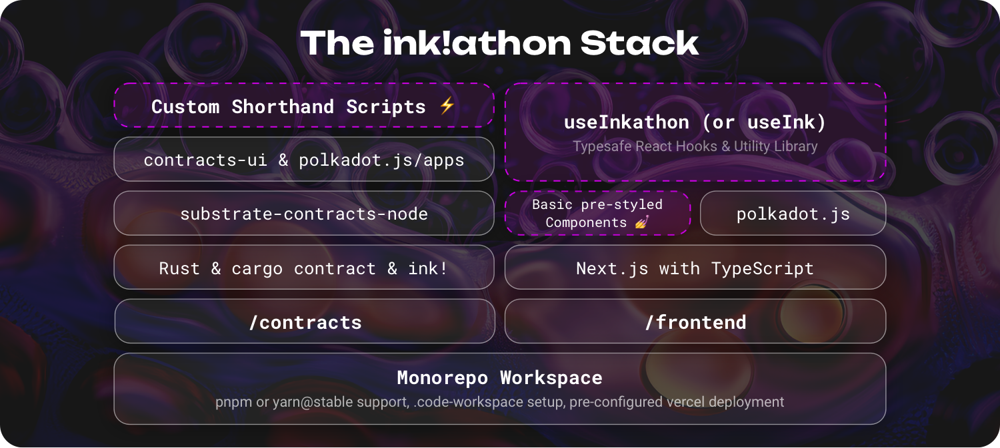

# ThreadHub

ThreadHub is a decentralized opinion sharing platform, where users can express their opinions via threads and receive engagements from other users. Think twitter, but onchain.

This project is a concept that demonstrates the possibilities that can be built on Polkadot and was submitted for the [Encode X Polkadot Hackathon.](https://www.encode.club/encode-polkadot-hackathon)

## Features
- **Authentication:** 

   Users can connect their polkadot wallets to the platform, for signing transactions.
- **Thread Creation:**  

## Getting started 🚀

### 1. Run the frontend

The frontend works out of the box, without a local node running, as the sample contract is pre-deployed on certain live testnets (i.e. `alephzero-testnet` and `shibuya`). Necessary deployment metadata and addresses are provided under `contracts/deployments/`.

> **Pre-requisites:**
>
> - Setup Node.js v18+ (recommended via [nvm](https://github.com/nvm-sh/nvm) with `nvm install 18`)
> - Install [pnpm](https://pnpm.io/installation) (recommended via [Node.js Corepack](https://nodejs.org/api/corepack.html) or `npm i -g pnpm`)
> - Clone this repository

<details>
<summary><strong>Special Instructions for Windows Users</strong></summary>

> [!IMPORTANT]  
> Windows users must either use [WSL](https://learn.microsoft.com/windows/wsl/install) (recommended) or a custom shell like [Git Bash](https://git-scm.com/downloads). PowerShell is not supported.

> **Pre-requisites when using WSL for Linux:**
>
> - Install [WSL](https://learn.microsoft.com/windows/wsl/install) and execute _all_ commands in the WSL terminal
> - Setup Node.js v18+ (recommended via [nvm](https://github.com/nvm-sh/nvm) with `nvm install 18`)
> - Install the following npm packages globally:
> - `npm i -g npm`
> - `npm i -g pnpm node-gyp make`
> - Clone this repository into the WSL file system (e.g. `/home/<user>/inkathon`).
>
> **Tip:** You can enter `\\wsl$\` in the top bar of the Windows Explorer to access the WSL file system visually.

</details>

```bash
# Install dependencies (once)
# NOTE: This automatically creates an `.env.local` file
pnpm install

# Start Next.js frontend
pnpm run dev
```

Optionally, to enable [`simple-git-hooks`](https://github.com/toplenboren/simple-git-hooks) (for automatic linting & formatting when committing), you can run the following command once: `pnpm simple-git-hooks`.

### 2. Build & deploy contracts on a local node

The `contracts/package.json` file contains shorthand scripts for building, testing, and deploying your contracts. To run these scripts, you need to set `contracts/` as the active working directory in your terminal.

> **Pre-requisites:**
>
> - Install Rust via the [Substrate Docs](https://docs.substrate.io/install/) (skip the "Compile a Substrate node" section)
> - Install [`cargo contract`](https://github.com/paritytech/cargo-contract)
> - Install [`substrate-contracts-node`](https://github.com/paritytech/substrate-contracts-node)

```bash
# Build contracts and move artifacts to `contracts/deployments/{contract}/` folders
pnpm run build

# Start local node with persistence (contracts stay deployed after restart)
# NOTE: When using Brave, shields have to be taken down for the UIs
pnpm run node

## IMPORTANT: Open a separate terminal window and keep the node running

# Deploy the contracts on the local node
pnpm run deploy
```

Alternatively, you can also deploy contracts manually using [Contracts UI](https://contracts-ui.substrate.io/) (`pnpm contracts-ui`) in the browser.

### 3. Connect the frontend to the local node

Open the `frontend/.env.local` file and set the `NEXT_PUBLIC_DEFAULT_CHAIN` variable to `development`. Then restart the frontend and you should be able to interact with the contracts deployed on your local node.

_Read more about environment variables and all available chain constants in the [Environment Variables](#environment-variables) section below._

## The Stack 🥞

<details>
<summary><strong>The Stack in Detail</strong></summary>

- Monorepo Workspace with `contracts/` and `frontend/` directories as packages.
- Package Manager: `pnpm` or `yarn@stable` (Read more in the [FAQs](#faqs--troubleshooting) section below)
- Smart Contract Development: Rust, ink!, `cargo-contract`, `substrate-contracts-node`
- Frontend: Next.js (app-dir), React, TypeScript
  - Contract Interactions: `polkadot-js`, [`useInkathon`](https://github.com/scio-labs/use-inkathon) React Hooks & Utility Library (alternatively: [`useInk`](https://use.ink/frontend/getting-started))
  - Styling: `shadcn/ui`, `tailwindcss`
  - Linting & Formatting: `eslint`, `prettier`, `simple-git-hooks`, `lint-staged`
- Type-safe contract generation via [`typechain-polkadot`](https://github.com/Brushfam/typechain-polkadot)

<small>Styling, linting, and formatting libraries can be fully dropped or replaced with alternatives.</small>

</details>



### Environment Variables

All environment variables are imported from `process.env` in [`frontend/src/config/environment.ts`](https://github.com/scio-labs/inkathon/blob/main/frontend/src/config/environment.ts) and re-exported from there. For improved type safety, Always only import environment variables from `@/config/environment` and never directly from `process.env`.

| Environment Variables           | [Default Values](https://github.com/scio-labs/inkathon/blob/main/frontend/.env.local.example) | Description                                                                                                                                                         |
| ------------------------------- | --------------------------------------------------------------------------------------------- | ------------------------------------------------------------------------------------------------------------------------------------------------------------------- |
| `NEXT_PUBLIC_DEFAULT_CHAIN` \*️⃣ | ️`alephzero-testnet`                                                                          | The network (Substrate-based chain) the frontend should connect to by default and what contract deployment artifacts to import.                                     |
| `NEXT_PUBLIC_PRODUCTION_MODE`   | `false`                                                                                       | Optional boolean flag to differentiate production environment (e.g. for SEO or Analytics).                                                                          |
| `NEXT_PUBLIC_URL`               | `http://localhost:3000`                                                                       | Optional string that defines the base URL of the frontend (will be auto-inferred from Vercel environment variables).                                                |
| `NEXT_PUBLIC_SUPPORTED_CHAINS`  | –                                                                                             | Optional array with network identifers (e.g. `["alephzero-testnet", "shibuya"]`) that are supported by the frontend, **if the dApp is supposed to be multi-chain**. |

<small>\*️⃣ Required </small>

#### Supported Chains

One key element making this boilerplate so flexible is the usage of environment variables to configure the active network in the frontend. This is done by setting the `NEXT_PUBLIC_DEFAULT_CHAIN` variable in the `frontend/.env.local` file, or in the deployment settings respectively.

If your network is not provided by the `use-inkathon` library, you can add it manually by creating a new [`SubstrateChain`](https://github.com/scio-labs/use-inkathon/blob/main/src/chains.ts#L4) object. If you think a chain is missing, please open an issue or PR.

> [!IMPORTANT]  
> All supported chain constants [can be found here](https://github.com/scio-labs/use-inkathon/blob/main/src/chains.ts) in the `scio-labs/use-inkathon` repository.

### Contract Deployment

In the [Getting Started](#getting-started) section above, we've already deployed the sample `Greeter` contract on a local node. To target a live network, we can use the `CHAIN` environment variable when running the `deploy` script.

```bash
CHAIN=alephzero-testnet pnpm run deploy
```

Further, dynamically loaded environment files with the `.env.{chain}` naming convention can be used to add additional configuration about the deployer account.

```bash
# .env.alephzero-testnet
ACCOUNT_URI=bottom drive obey lake curtain smoke basket hold race lonely fit walk//Alice
```

When running the same script again, this deployer account defined there will be used to sign the extrinsic.