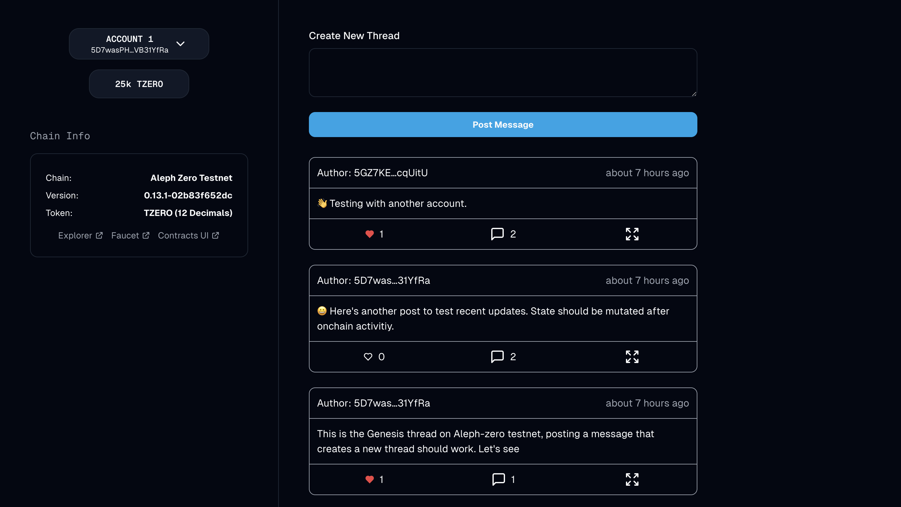

# ThreadHub

ThreadHub is a decentralized platform for sharing opinions, where users can express their opinions via threads and receive engagements from other users. Picture Twitter, but on the blockchain.

This project is a concept that demonstrates the possibilities that can be built on Polkadot and was submitted for the [Encode X Polkadot Hackathon.](https://www.encode.club/encode-polkadot-hackathon)

## Features
### Authentication:
Users can connect their polkadot wallets to the platform, to access threads and for signing transactions.


### Thread Creation:
Users can create threads by providing a message. A thread is linked to the creator's account and only them can update the message in the thread.


### Liking a Thread:
Users can like theirs and other users threads/replies. Likes are linked to an account and are unique, so they cannot be duplicated.


### Replying a Thread:
Threads on ThreadHub can be nested, where comments and replies are subthreads and behave exactly like threads, which means they can have subthreads too. 


## Technical Details
### Stack
- Monorepo Workspace with `contracts/` and `frontend/` directories as packages.
- Package Manager: `pnpm`
- Smart Contract Development: Rust, ink!, `cargo-contract`, `substrate-contracts-node`
- Frontend: Next.js (app-dir), React, TypeScript
  - Contract Interactions: [`polkadot-js`](https://polkadot.js.org/), [`useInkathon`](https://github.com/scio-labs/use-inkathon) React Hooks & Utility Library
  - Styling: `shadcn/ui`, `tailwindcss`
  - Client-side Data Fecthing: `swr`
  - Linting & Formatting: `eslint`, `prettier`, `simple-git-hooks`, `lint-staged`
- Type-safe contract generation via [`typechain-polkadot`](https://github.com/Brushfam/typechain-polkadot)

### Testing Instructions

> **Pre-requisites:**
>
> - Setup Node.js v18+ (recommended via [nvm](https://github.com/nvm-sh/nvm) with `nvm install 18`)
> - Install [pnpm](https://pnpm.io/installation) (recommended via [Node.js Corepack](https://nodejs.org/api/corepack.html) or `npm i -g pnpm`)
> - Clone this repository

#### 1. The Frontend

The frontend works out of the box, without a local node running, as the `thread_manager` contract is pre-deployed on `alephzero-testnet`. Necessary deployment metadata and addresses are provided under `contracts/deployments/`.

```bash
# Install dependencies (once)
# NOTE: This automatically creates an `.env.local` file
pnpm install

# Start Next.js frontend
pnpm run dev
```

#### 2. Building & deploying `thread_manager` on a local node

The `contracts/package.json` file contains shorthand scripts for building, testing, and deploying the `thread_manager` . To run these scripts, set `contracts/` as the active working directory in your terminal.

> **Pre-requisites:**
>
> - Install Rust via the [Substrate Docs](https://docs.substrate.io/install/) (skip the "Compile a Substrate node" section)
> - Install [`cargo contract`](https://github.com/paritytech/cargo-contract)
> - Install [`substrate-contracts-node`](https://github.com/paritytech/substrate-contracts-node)

```bash
# Build contracts and move artifacts to `contracts/deployments/{contract}/` folders
pnpm run build

# Start local node with persistence (contracts stay deployed after restart)
# NOTE: When using Brave, shields have to be taken down for the UIs
pnpm run node

## IMPORTANT: Open a separate terminal window and keep the node running

# Deploy the contracts on the local node
pnpm run deploy

# Upload the `thread` contract `code_hash` onchain to enabel Cross-Contract calling in the `thread_manager`contract
cargo contract upload --manifest-path src/thread/Cargo.toml --suri //Alice -x
```

#### 3. Connect the frontend to the local node

Open the `frontend/.env.local` file and set the `NEXT_PUBLIC_DEFAULT_CHAIN` variable to `development`. Then restart the frontend and you should be able to interact with the contracts deployed on your local node.

### Environment Variables

All environment variables are imported from `process.env` in [`frontend/src/config/environment.ts`](https://github.com/scio-labs/inkathon/blob/main/frontend/src/config/environment.ts) and re-exported from there. For improved type safety, Always only import environment variables from `@/config/environment` and never directly from `process.env`.

| Environment Variables           | [Default Values](https://github.com/scio-labs/inkathon/blob/main/frontend/.env.local.example) | Description                                                                                                                                                         |
| ------------------------------- | --------------------------------------------------------------------------------------------- | ------------------------------------------------------------------------------------------------------------------------------------------------------------------- |
| `NEXT_PUBLIC_DEFAULT_CHAIN` \*️⃣ | ️`alephzero-testnet`                                                                          | The network (Substrate-based chain) the frontend should connect to by default and what contract deployment artifacts to import.                                     |
| `NEXT_PUBLIC_PRODUCTION_MODE`   | `false`                                                                                       | Optional boolean flag to differentiate production environment (e.g. for SEO or Analytics).                                                                          |
| `NEXT_PUBLIC_URL`               | `http://localhost:3000`                                                                       | Optional string that defines the base URL of the frontend (will be auto-inferred from Vercel environment variables).                                                |
| `NEXT_PUBLIC_SUPPORTED_CHAINS`  | –                                                                                             | Optional array with network identifers (e.g. `["alephzero-testnet", "shibuya"]`) that are supported by the frontend, **if the dApp is supposed to be multi-chain**. |

<small>\*️⃣ Required </small>


> [!IMPORTANT]  
> All supported chain constants [can be found here](https://github.com/scio-labs/use-inkathon/blob/main/src/chains.ts) in the `scio-labs/use-inkathon` repository.
